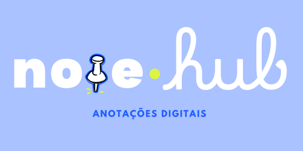
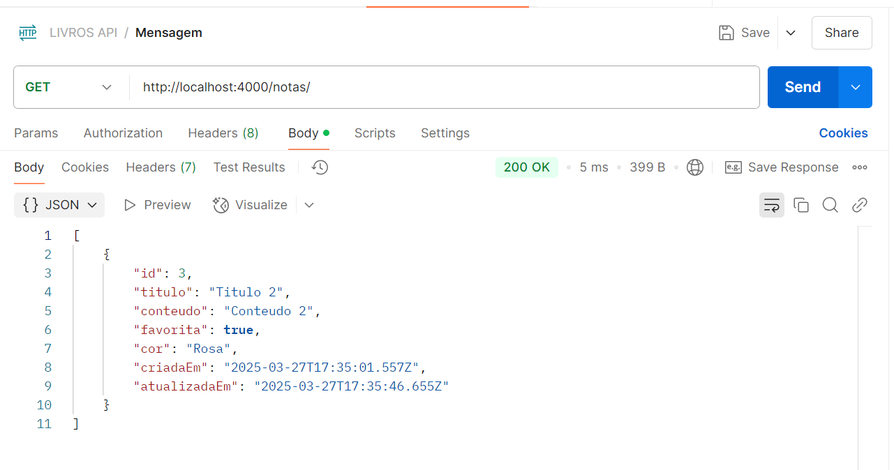
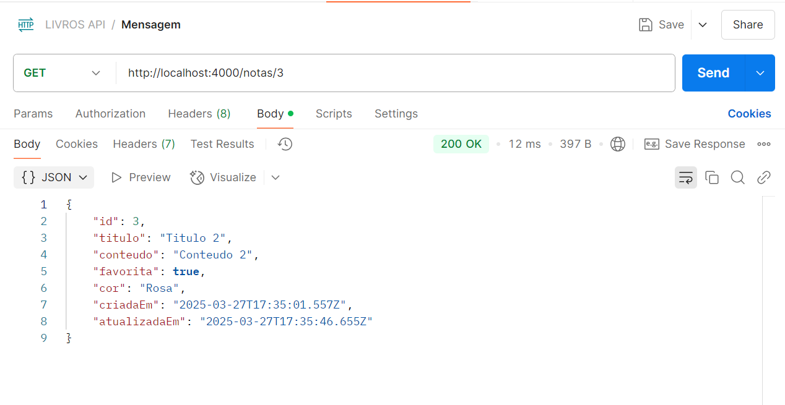
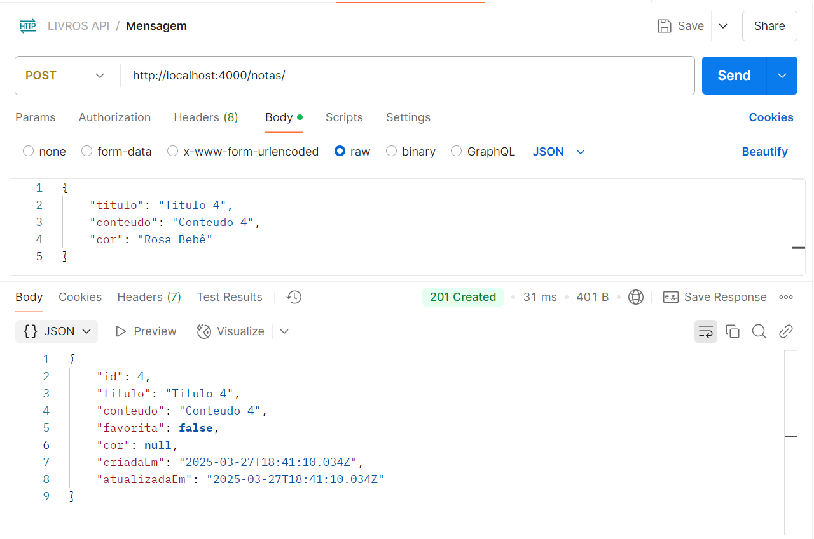
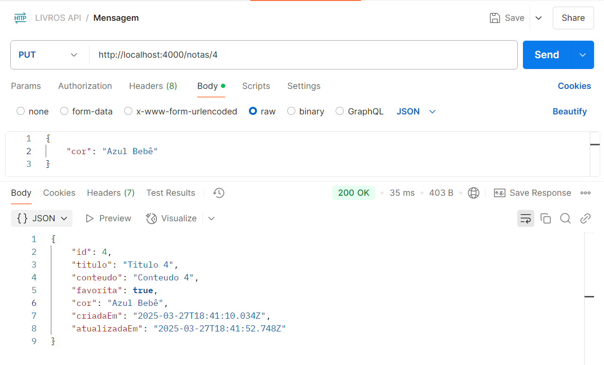
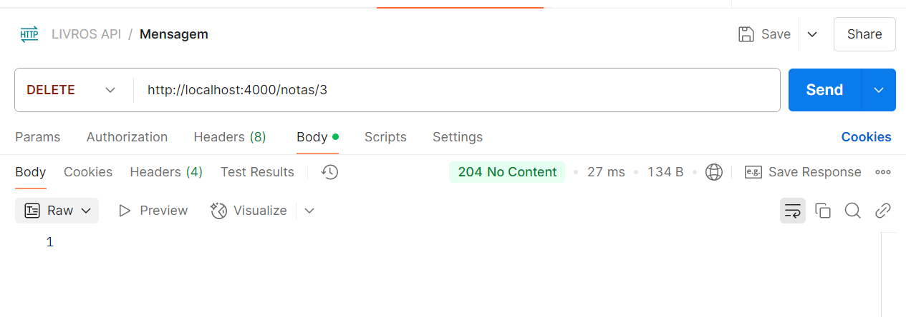

# 📌NoteHub API


## 📝 Introdução
**Desafio Proposto:** A startup "NoteHub" está desenvolvendo um aplicativo simples de anotações digitais para estudantes. O aplicativo precisa de uma API backend para armazenar e gerenciar as anotações dos usuários. Como o projeto está em fase inicial, a versão 1.0 trabalhará apenas com anotações, sem sistema de usuários ou categorias complexas.

## 📅 API Endpoints
| Método HTTP | Endpoint         | Descrição                          |
|-------------|------------------|------------------------------------|
| GET         | /notas           | Retorna todas as anotações        |
| GET         | /notas/{id}      | Retorna uma anotação específica   |
| POST        | /notas           | Cria uma nova anotação            |
| PUT         | /notas/{id}      | Atualiza uma anotação existente   |
| DELETE      | /notas/{id}      | Remove uma anotação específica    |
### Exemplos de requisições e respostas para cada endpoint
#### GET /notas
```http://localhost:4000/notas```

```json
[
    {
        "id": 1,
        "titulo": "Anotação 1",
        "conteudo": "Conteúdo da anotação 1",
        "dataCriacao": "2021-10-10T00:00:00.000Z",
        "dataAtualizacao": "2021-10-10T00:00:00.000Z"
    },
    {
        "id": 2,
        "titulo": "Anotação 2",
        "conteudo": "Conteúdo da anotação 2",
        "dataCriacao": "2021-10-10T00:00:00.000Z",
        "dataAtualizacao": "2021-10-10T00:00:00.000Z"
    }
]
```


#### GET /notas/{id}
```http://localhost:4000/notas/1```

```json
{
    "id": 1,
    "titulo": "Anotação 1",
    "conteudo": "Conteúdo da anotação 1",
    "dataCriacao": "2021-10-10T00:00:00.000Z",
    "dataAtualizacao": "2021-10-10T00:00:00.000Z"
}
```


#### POST /notas
```http://localhost:4000/notas```

```json
{
    "titulo": "Nova Anotação",
    "conteudo": "Conteúdo da nova anotação"
}
```


#### PUT /notas/{id}
```http://localhost:4000/notas/4```

```json
{
    "titulo": "Anotação Atualizada",
    "conteudo": "Conteúdo da anotação atualizada"
}
```


#### DELETE /notas/{id}
```http://localhost:4000/notas/4```


## 🛠 Tecnologias Utilizadas
| [](https://nodejs.org/) | [](https://expressjs.com/) | [](https://www.prisma.io/) | [](https://www.sqlite.org/) |

- Node.js
- Express
- Prisma
- SQLite

## 📊 Como Executar
1. Instale as dependências do projeto:

```bash
npm install
```

2. Crie o arquivo `.env` com a variável `DATABASE_URL` apontando para o banco de dados desejado.

```
DATABASE_URL="file:./dev.db"
```

3. Execute as migrações:

```bash
npx prisma migrate dev
```

4. Inicie o servidor:

```bash
npm run dev
```

## 📚Licença
Este projeto está licenciado sob a Licença MIT - consulte o arquivo [LICENSE](./LICENSE) para obter detalhes.